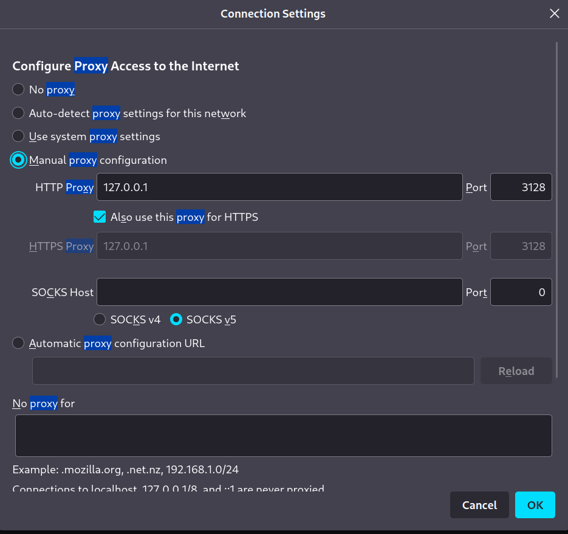
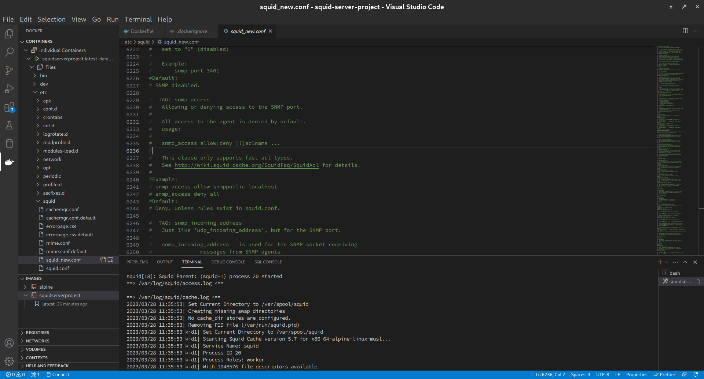

# Squid Server utilizing proxy for Caching and access control

## Starting the server
### In Background
    docker run --rm -d -p 3128:3128/tcp squidserverproject:latest
### Viewing logs
    docker run --rm -it -p 3128:3128/tcp squidserverproject:latest
    

## Default configuration
The default configuration exposes port `3128` and allows traffic from the host machine only i.e. `127.0.0.1:3128`. For allowing traffic within a localnetwork, firewalls must be set accordingly in the host machine.

## Using other distros (Change in [Dockerfile](./Dockerfile))

### For Fedora

Replace 
    
    ARG squid_configuration_host="./squid_alpine.conf"

with

    ARG squid_configuration_host="./squid_fedora.conf"

And for package installation

Replace 

    # The squid package
    RUN apk add --no-cache squid

With

    # The squid package
    RUN dnf install squid && dnf autoremove && rm -rf /var/cache/dnf

## Changing the configuration
Before build stage, the configuration for respective distros can be changed from the source file.

Full documentation is present in [squid_alpine.conf](./squid_alpine.conf)

The config used at runtime is `/etc/squid/squid_new.conf` and can be changed through container.

